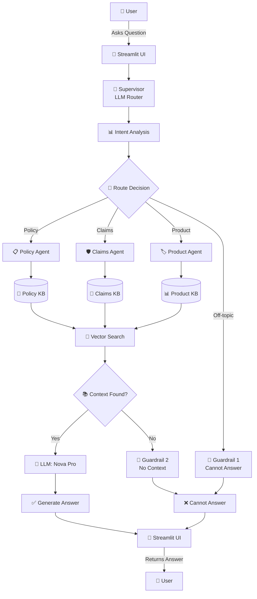

# Multi-Agent Automotive Insurance QA Prototype (POC)

This repository serves as an architectural **Proof of Concept (POC)** and simulation of an end-to-end, multi-agent car insurance question-answering system ( Policy Agent, Claims Agent, Product Agen). The project focuses on demonstrating **orchestration frameworks** and **cloud-native AI platform designs** by routing and resolving simulated user queries across distinct functional domains.

The system implements a hybrid architecture that combines **code-centric orchestration** for multi-agent state routing with a **fully managed cloud RAG pipeline (Knowledge Bases for Amazon Bedrock)** to handle simulated policy guidelines, product catalogs, and claims processing workflows. 

*Note: This is an exploratory prototype designed to evaluate multi-agent orchestration patterns using mock data. It is not an enterprise-ready implementation and does not contain live legal compliance guardrails or state-specific statutory provisions.*

## Core Architectural Concepts Under Evaluation

* **Hybrid State Graph Orchestration**: Rather than relying on rigid sequential pipelines, the prototype evaluates the **Supervisor Pattern** using **LangGraph**. Through pythonic state declarations (`StateGraph`), the system runs a basic layout to manage multi-agent communication and track conversation flow (`Shared Session Memory`).
* **Cloud-Native Ingestion & Retrieval**: To bypass the operational overhead of setting up local vector databases or complex text-splitting workflows during prototyping, ingestion and retrieval are offloaded to **AWS Bedrock Knowledge Bases**. The backend utilizes the standard `boto3` SDK to interact with the managed service via the `retrieve_and_generate` API.
* **Decoupled Prototype Design**: The system maintains a clean separation of concerns by utilizing **Streamlit** for a lightweight, standalone user interface, while keeping the core agent logic independent of the frontend layout to allow for easier logic modifications.

---

## Architecture Diagram

The layout of the prototype centers around a centralized **Routing Workflow** that manages the `AgentState` data structure. Based on the user's input, this workflow handles intent evaluation and acts as a traffic controller to dispatch the query to the appropriate mock domain agent:


---

## 🛠️ Tech Stack & Service Components

* **Orchestration Framework**: LangGraph (`StateGraph`) — Handles multi-agent memory and routing workflows.
* **Cloud AI Service (LLM)**: Amazon Nova Pro (`amazon.nova-pro-v1:0`) — Accessed via Amazon Bedrock API for response synthesis.
* **Vector Storage & RAG**: Knowledge Bases for Amazon Bedrock — Manages document ingestion and serverless RAG execution.
* **AWS SDK**: Python (`boto3`) — Executes the standard `retrieve_and_generate` function calls for sub-agent tools.
* **Application Frontend**: Streamlit — Serves as a standalone localized chat interface.

---

## Getting Started

### 1. Prerequisites & Environment Setup

Ensure your local environment has active AWS credentials configured (`aws configure`) and that your IAM identity possesses execution permissions for Amazon Bedrock models and the target Knowledge Bases.

### 2. Install Dependencies

```bash
pip install -r requirements.txt

```

### 3. Run the Backend Agent Locally

```bash
python langgraph_insurance_agent.py

```

### 4. Launch the Frontend UI

```bash
streamlit run app.py

```
---

## Evaluation & Test Scenarios

The system has been programmatically evaluated against realistic car insurance scenarios—specifically focusing on highly localized statutory variations (such as Connecticut's unique coverage laws) across three specific operational boundaries:

1. **Policy Coverage & Premium Evaluation (Policy Domain)**:
* *Input*: *"What are the standard exclusions under the Connecticut personal auto policy endorsement?"*
* *Routing Lifecycle*: `Supervisor` ➡️ Policy Intent Recognized ➡️ `policy_agent` ➡️ Queries Policy Knowledge Base ➡️ Extracts exact policy parameters.


2. **Dynamic Incident Handling (Claims Domain)**:
* *Input*: *"I just rear-ended someone in West Hartford, what do I do next?"*
* *Routing Lifecycle*: `Supervisor` ➡️ Claims/Accident Intent Recognized ➡️ `claims_agent` ➡️ Queries Claims Knowledge Base ➡️ Synthesizes a localized step-by-step claims filing guide.


3. **Insurance Offerings & Bundling Options (Product Domain)**:
* *Input*: *"Does this company offer a combined umbrella option or multi-car discount packages?"*
* *Routing Lifecycle*: `Supervisor` ➡️ Product Information Intent Recognized ➡️ `product_agent` ➡️ Queries Product Knowledge Base ➡️ Returns cross-selling and product availability matrices.

---

## 💡 Engineering Insights & Key Learnings

Building this multi-agent car insurance POC provided deep hands-on experience in balancing cloud-native infrastructure efficiency with agentic workflow predictability.  Below are the core technical challenges encountered and resolved during implementation:

### 1. Eliminating LLM Non-Determinism Across Environments
* **The Challenge**: During baseline testing, identical prompts and centralized configurations yielded inconsistent results across the local testing script (`agents_testing_claims.py`) and the Streamlit web UI (`app.py`). The discrepancies weren't just stylistic; the core answers drifted in completely different factual and logical directions.
* **What I Tried**: Refactored `config.py` to introduce a centralized `INFERENCE_CONFIG` with `temperature` explicitly forced to `0.0`. By default, invoking the Amazon Bedrock `retrieve_and_generate` API without an explicit `inferenceConfig` uses a non-zero temperature (typically `0.7`), triggering probabilistic token sampling that causes semantic drift across isolated runtime sessions.
* **The Result**: This mitigation **successfully resolved the semantic drift**. Forcing the temperature to `0.0` ensured that the core accuracy and business logic of the answers always aligned in the exact same direction across both environments. However, it **did not achieve absolute token-for-token formatting symmetry**, proving that while temperature controls the logical direction, secondary runtime factors (such as LangGraph state overhead and micro-variances in vector chunk retrieval order) still influence the final syntactic layout.

### 2. Upgrading Routing: From Rigid Keywords to LLM Semantic Routing
* **The Edge Case**: During baseline testing, a classic keyword collision bug occurred. When a user asked: *"My friend borrowed my car and got into an **accident**. Am I **covered**?"*, a traditional string-matching router incorrectly forced the flow into the **Claims Agent** because it flagged the word "accident", completely ignoring that the core user intent was to verify policy eligibility.
* **The Solution**: Hardcoded keyword matching cannot resolve cross-domain semantic overlap. To achieve a **well-governed and reliable** environment, the architecture was refactored to use an **LLM-driven Semantic Router**. By introducing a lightweight intent-classification prompt, the core model now reads the comprehensive semantic meaning, accurately directing such complex boundary queries to the **Policy Agent**.

### 3. FinOps Awareness: Navigating Serverless Cost Realities
* **The Discovery**: A major operational takeaway involved monitoring the hidden billing mechanisms of **Amazon OpenSearch Serverless (AOSS)**. While conceptually "serverless", AOSS maintains a default baseline capacity allocation (1 Indexing OCU + 1 Search OCU) to ensure high availability, translating to a ~ $5/day fixed infrastructure cost even when the application sits entirely idle.
* **The Practice**: For a lean prototype and RAG evaluation phase, strict environment lifecycle management is essential. The development pipeline was standardized to tear down AOSS collections during extended downtime. For production scaling, this insight guides future architectural revisions to leverage true scale-to-zero capabilities or transition to cost-efficient single-instance vector stores during early testing.

---

## Future Roadmap

1. **LLM-Driven Semantic Router**: Upgrade the current keyword-matching logic inside the `supervisor` node to a fully dynamic semantic intent router using a lightweight Bedrock LLM call, improving routing robustness against ambiguous user phrasings.
2. **Model Context Protocol (MCP) Integration**: Wrap the underlying S3 buckets and internal claiming databases into a standardized MCP Server ecosystem, unlocking complete framework-agnostic tool usage (`Tool Use`) for future agent extensions.
3. **Migration to AWS Bedrock AgentCore**: Package the local LangGraph state-machine into a managed AgentCore runtime to leverage production-ready API Gateways, native CloudWatch performance metrics, and automated AWS Guardrails for input/output sanitization.

---

## Repository Structure

```text
├── langgraph_insurance_agent.py  # Core Backend: LangGraph Multi-Agent framework and boto3 logic
├── app.py                        # Frontend: Streamlit application and UI session state management
├── requirements.txt              # Project dependencies (boto3, langgraph, streamlit)
└── README.md                     # System documentation

```