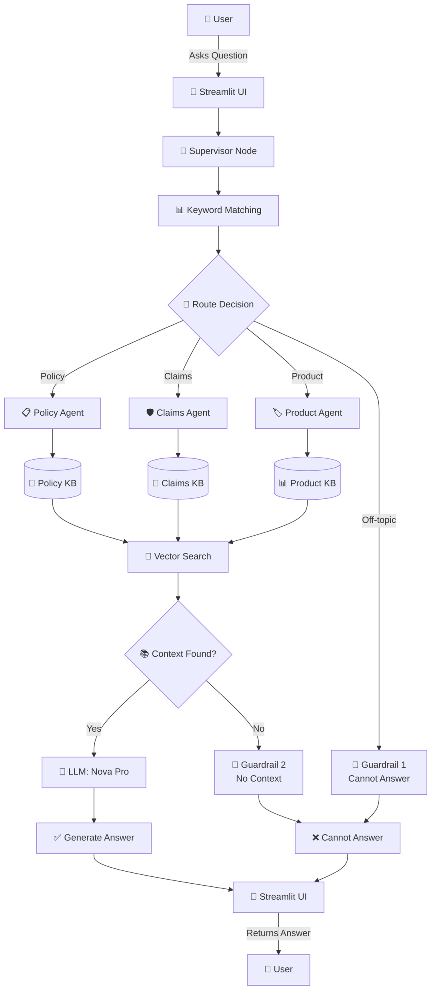

# Multi-Agent Automotive Insurance QA Prototype (POC)

This repository is an architectural **Proof of Concept (POC)** and showcase of an end-to-end, multi-agent car insurance question-answering system (Policy Agent, Claims Agent, Product Agent). The project focuses on demonstrating **orchestration frameworks** and **cloud-native AI platform designs** by routing and resolving simulated user questions across distinct functional domains.

The system is designed with a hybrid architecture that combines the following 3 parts:
1. **Amazon Bedrock Managed Knowledge Bases (cloud RAG pipeline)**: for handling simulated policy guidelines, product catalogs, and claims processing workflows.  
2. **Supervisor workflow orchestration (local coding)**: This part shows how the user questions are routed to the appropriate agent and how each agent handles the question, prompt template design and hallucination mitigation.
3. **Streamlit for User-Facing UI Design**


Details of each part are shown in the section below.

*Note: This is an exploratory prototype designed to evaluate multi-agent orchestration patterns using mock data. It is a phase-1 implementation and does not contain live legal compliance guardrails or state-specific statutory provisions.*

## Core Architectural Concepts Under Evaluation

* **Hybrid State Graph Orchestration**: Rather than relying on rigid sequential pipelines, the prototype evaluates the **Supervisor Pattern** using **LangGraph**. Through pythonic state declarations (`StateGraph`), the system runs a basic layout to manage multi-agent communication and track conversation flow (`Shared Session Memory`).
* **Cloud-Native Ingestion & Retrieval**: To bypass the operational overhead of setting up local vector databases or complex text-splitting workflows during prototyping, ingestion and retrieval are offloaded to **AWS Bedrock Knowledge Bases**. The backend utilizes the standard `boto3` SDK to interact with the managed service via the `retrieve_and_generate` API.
* **Decoupled Prototype Design**: The system maintains a clean separation of concerns by utilizing **Streamlit** for a lightweight, standalone user interface, while keeping the core agent logic independent of the frontend layout to allow for easier logic modifications.

---

## Architecture Diagram

The layout of the prototype centers around a centralized **Routing Workflow** that manages the `AgentState` data structure. Based on the user's input, this workflow handles intent evaluation and acts as a traffic controller to dispatch the query to the appropriate mock domain agent:


```mermaid
flowchart TD
    A[👤 User] -->|Asks Question| B[💬 Streamlit UI]
    
    B --> C[🎯 Supervisor Node]
    C --> D[📊 Keyword Matching]
    D --> E{🔀 Route Decision}
    
    E -->|Policy| F[📋 Policy Agent]
    E -->|Claims| G[🛡️ Claims Agent]
    E -->|Product| H[🏷️ Product Agent]
    E -->|Off-topic| I[🚫 Guardrail 1<br>Cannot Answer]
    
    F --> J[(📄 Policy KB)]
    G --> K[(📑 Claims KB)]
    H --> L[(📊 Product KB)]
    
    J --> M[🔎 Vector Search]
    K --> M
    L --> M
    
    M --> N{📚 Context Found?}
    N -->|Yes| O[🤖 LLM: Nova Pro]
    N -->|No| P[🚫 Guardrail 2<br>No Context]
    
    O --> Q[✅ Generate Answer]
    I --> R[❌ Cannot Answer]
    P --> R
    
    Q --> S[💬 Streamlit UI]
    R --> S
    
    S -->|Returns Answer| T[👤 User]

```
---

## 🛠️ Tech Stack & Service Components

* **Orchestration Framework**: LangGraph (`StateGraph`) — Handles multi-agent memory and routing workflows.
* **Cloud AI Service (LLM)**: Amazon Nova Pro (`amazon.nova-pro-v1:0`) — Accessed via Amazon Bedrock API for response synthesis.
* **Vector Storage & RAG**: Knowledge Bases for Amazon Bedrock — Manages document ingestion and serverless RAG execution.
* **AWS SDK**: Python (`boto3`) — Executes the standard `retrieve_and_generate` function calls for sub-agent tools.
* **Application Frontend**: Streamlit — Serves as a standalone localized chat interface.

---


## Evaluation & Test Scenarios

We evaluated three functional domains (Policy, Claims, Product) using representative user queries. All tests follow a unified routing pipeline: **supervisor → intent classification → domain agent → knowledge base retrieval → response synthesis**. Sample queries listed below

| Domain   | Sample User Query                                                                                   |
|----------|-----------------------------------------------------------------------------------------------------|
| Policy   | "What does liability coverage cover? "          |
| Claims   | "My friend borrowed my car and got into an accident. Am I covered?"                                   |
| Product  | "What is the good student discount?"               |

---

## 💡 Engineering Insights & Key Learnings

Building this multi-agent car insurance POC provided deep hands-on experience in balancing cloud-native infrastructure efficiency with agentic workflow predictability.  Below are the core technical challenges encountered and resolved during implementation:

### 1. Eliminating LLM Non-Determinism Across Environments
* **The Challenge**: During baseline testing, identical prompts and centralized configurations yielded inconsistent results across the local testing script (`agents_testing_claims.py`) and the Streamlit web UI (`app.py`). The discrepancies weren't just stylistic; the core answers drifted in completely different directions.
* **What I Tried**: Refactored `config.py` to introduce a centralized `INFERENCE_CONFIG` with `temperature` explicitly forced to `0.0`. By default, invoking the Amazon Bedrock `retrieve_and_generate` API without an explicit `inferenceConfig` uses a default temperature, which adds randomness and causes different outputs across runs.
* **The Result**: Answers are now logically aligned across both environments. Final wording still varies slightly due to other runtime factors (LangGraph state, retrieval order etc.), but the core content is consistent. 

### 2. Upgrading Routing: From Rigid Keywords to LLM Semantic Routing
* **The Edge Case**: During baseline testing, a classic keyword collision bug occurred. When a user asked: *"My friend borrowed my car and got into an **accident**. Am I **covered**?"*, a traditional string-matching router incorrectly forced the flow into the **Claims Agent** because it flagged the word "accident", completely ignoring that the core user intent was to verify policy eligibility.
* **The Solution**: Hardcoded keyword matching cannot resolve cross-domain semantic overlap. To achieve a **well-governed and reliable** environment, the architecture will need to be refactored to use an **LLM-driven Semantic Router**. By introducing a lightweight intent-classification prompt, the core model will read the comprehensive semantic meaning, accurately directing such complex boundary queries to the **Policy Agent**.

### 3. FinOps Awareness: Navigating Serverless Cost Realities
* **The Discovery**:  A key operational insight came from monitoring the billing behavior of Amazon OpenSearch Serverless (AOSS). Although marketed as "serverless," AOSS reserves a baseline amount of capacity at all times for high availability. In the author's region, this costs about $5/day even when the system is completely idle.
* **The Practice**: For a lean prototype and RAG evaluation phase, strict environment lifecycle management is essential. The author standardized the pipeline to tear down AOSS collections during extended downtime. For production, this cost consideration needs to be factored into the overall architecture planning.

---

## Future Roadmap

1. **LLM-Driven Semantic Router**: Replace keyword matching with semantic intent routing using a lightweight Bedrock LLM call for better handling of ambiguous queries.
2. **Testing, Observability & Evaluation**: Add metrics, monitoring, audit logging, tracing, and an evaluation harness to improve system reliability and enable regression testing.
3. **Model Context Protocol (MCP) Integration**: Expose S3 buckets as MCP-compliant tools, so they can work with any agent framework without having to rebuild the connections each time.

---

## Repository Structure

```text
Phase1_FoundationWorkflow/
├── README.md                          # Project overview, setup, and architecture summary
├── agent_engine.py                    # LangGraph workflow: Supervisor + 3 specialized agents + routing logic
├── config.py                          # Central config: KB IDs, prompts, inference settings
├── frontend_app.py                    # Streamlit UI with chat interface and session memory
└── Test/
    ├── agents_testing_claims.py       # Standalone tests for Claims Agent
    ├── agents_testing_policy.py       # Standalone tests for Policy Agent
    └── agents_testing_products.py     # Standalone tests for Product Agent

```
